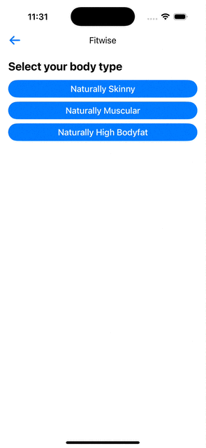

An evidence-based workout tracker. Released under the public domain.

- Auto-generate workout plans.
- Smart autoregulation that adjusts your training based on performance.
- Auto progressive overload with plateau detection.
- Evidence-based algorithm based training science.
- Exercise tutorials with videos.
- SwiftUI-based core for a lightweight structure.
- Runs 100% offline. No servers, nothing weird going on.
- Fitwise is accessible & supports VoiceOver!

## Showroom
<table>
<tr>
<td>
Smart onboarding
</td>
<td>
Tailor-made workout plans
</td>
<td>
Adjust workout frequency
</td>
<td>
Auto-logging
</td>
<td>
Exercise tutorials
</td>
</tr>

<tr>
<td>

</td>
<td>

</td>
<td>

</td>
<td>

</td>
<td>

</td>
</tr>

</table>

## Backend
Backend architected with [Realm SwiftUI](https://github.com/realm/realm-swift). 


## Community

Author | Contributing | Need Help?
--- | --- | ---
Fitwise was created [Keshav Khaneja](https://keshav.me) during winter of 2023. | All contributions are welcome. Just [fork](https://github.com/khaneja/fitwise/fork) the repo, then make a pull request. | Open an [issue](https://github.com/khaneja/fitwise/issues). You can also ping me on [Twitter]([https://twitter.com/aheze0](https://twitter.com/khaneja52)).


## License

```
MIT License

Copyright (c) 2023 K. Khaneja

Permission is hereby granted, free of charge, to any person obtaining a copy
of this software and associated documentation files (the "Software"), to deal
in the Software without restriction, including without limitation the rights
to use, copy, modify, merge, publish, distribute, sublicense, and/or sell
copies of the Software, and to permit persons to whom the Software is
furnished to do so, subject to the following conditions:

The above copyright notice and this permission notice shall be included in all
copies or substantial portions of the Software.

THE SOFTWARE IS PROVIDED "AS IS", WITHOUT WARRANTY OF ANY KIND, EXPRESS OR
IMPLIED, INCLUDING BUT NOT LIMITED TO THE WARRANTIES OF MERCHANTABILITY,
FITNESS FOR A PARTICULAR PURPOSE AND NONINFRINGEMENT. IN NO EVENT SHALL THE
AUTHORS OR COPYRIGHT HOLDERS BE LIABLE FOR ANY CLAIM, DAMAGES OR OTHER
LIABILITY, WHETHER IN AN ACTION OF CONTRACT, TORT OR OTHERWISE, ARISING FROM,
OUT OF OR IN CONNECTION WITH THE SOFTWARE OR THE USE OR OTHER DEALINGS IN THE
SOFTWARE.
```
> **Note**  
> You can technically clone Fitwise and sell it on the App Store, but I'd appreciate it if you didn't do this. Instead, please make any changes you want to the main repo — all pull requests are welcome!
